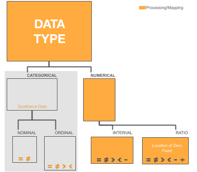
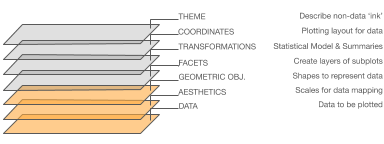

<hr style="border: 8px solid#0B0B0B;" />


# Introduction to Data Types, Data Visualization & Visual Storytelling

**Author list:** [Elias Castro Hernandez](https://www.linkedin.com/in/ehcastroh/) and [Alexander Fred-Ojala](https://www.linkedin.com/in/alexanderfo/)

**Learning Goal(s):** This series of notebooks provides the foundations for building and understanding current state-of-the-art visualizations. It covers both the theory and techniques of various visualization paradigms, giving learners the tools to build and evaluate visualization systems, engage with visualization literature, and communicate effectively with data.

<hr style="border: 4px solid#0B0B0B;" />

### About

These notebooks provide a rapid introduction to Python visualization libraries - from core libraries like Matplotlib and Seaborn through advanced interactive tools like Plotly and Altair. The series is structured into three notebooks plus hands-on breakout exercises.

---

## Quick Start

### Requirements

```bash
pip install matplotlib seaborn pandas numpy plotnine plotly altair vega_datasets scipy colorlover
```

Or with conda:

```bash
conda install matplotlib seaborn pandas numpy plotly altair scipy
pip install plotnine colorlover
```

### Running the Notebooks

```bash
git clone <this-repo>
cd Visual_Types_and_Data_Visualization
jupyter notebook
```

Open any of the three notebooks in the root directory to begin.

---

## Notebooks

### Notebook 01 - Introduction to Data Types and Visualization Principles

`visualization-intro-01_visualization-principles-w-matplotlib-and-seaborn.ipynb`



- Principles of visualization and data classification theory
- Data types (nominal, ordinal, quantitative) and their connection to chart selection
- Overview of Matplotlib (figure/axes/artist model)
- Overview of Seaborn (statistical visualization)
- Reference galleries and additional resources

---

### Notebook 02 - One Chart Across Several Visualization Libraries

`visualization-intro-02_one-chart-several-visualization-libraries.ipynb`



- Brief review of data types
- A tour of Python's entry-level visualization landscape (Pandas, Matplotlib, Seaborn, Plotnine)
- Two dynamic visualization libraries using real-world data (Plotly, Altair)
- One plot shown as static, dynamic, and interactive (Matplotlib → Plotly → K3D)

---

### Notebook 03 - Zero-Coding Visualization Libraries and Dashboards

`visualization-intro-03_intro-to-tableau-and-visualization-hosting.ipynb`

- Introduction to Tableau Online (no-code visualization)
- Tufte's visualization principles applied in practice
- Intro to Plotly Dash (Python dashboards)

---

## Breakout Exercises

Hands-on exercises are in the `breakouts/` directory, one per notebook session:

| Session | Topic | Directory |
|---|---|---|
| S1 | Plotting with Matplotlib | `breakouts/S1/` |
| S2 | Multi-library visualization | `breakouts/S2/` |
| S3 | Interactive and dashboard visualizations | `breakouts/S3/` |

Each breakout directory has its own README with setup instructions.

---

## Repository Structure

```
/
├── visualization-intro-01_*.ipynb    # Notebook 01
├── visualization-intro-02_*.ipynb    # Notebook 02
├── visualization-intro-03_*.ipynb    # Notebook 03
├── breakouts/
│   ├── S1/                           # Breakout exercises for Notebook 01
│   ├── S2/                           # Breakout exercises for Notebook 02
│   └── S3/                           # Breakout exercises for Notebook 03
├── data/                             # Datasets (Iris, BII sample, tableau images)
├── images/                           # Visualization theory reference images
├── resources/                        # PDFs and cheatsheets
├── DASH_Plotly/                      # Standalone Dash demo application
└── README.md
```

---

## References

- Wilkinson, L. - *The Grammar of Graphics* (copy in `resources/`)
- Tufte, E. - *The Visual Display of Quantitative Information* (copy in `resources/`)
- Stanford CS 448B - Data Visualization Techniques
- Nicolas P. Rougier's Matplotlib Tutorial

<hr style="border: 2px solid#0B0B0B;" />
